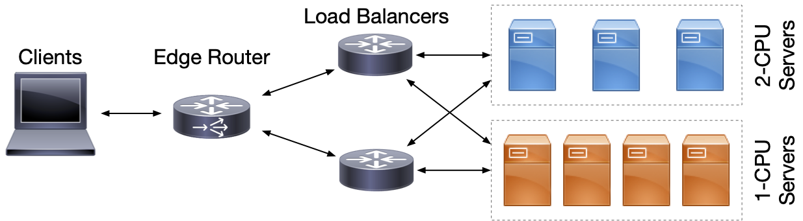
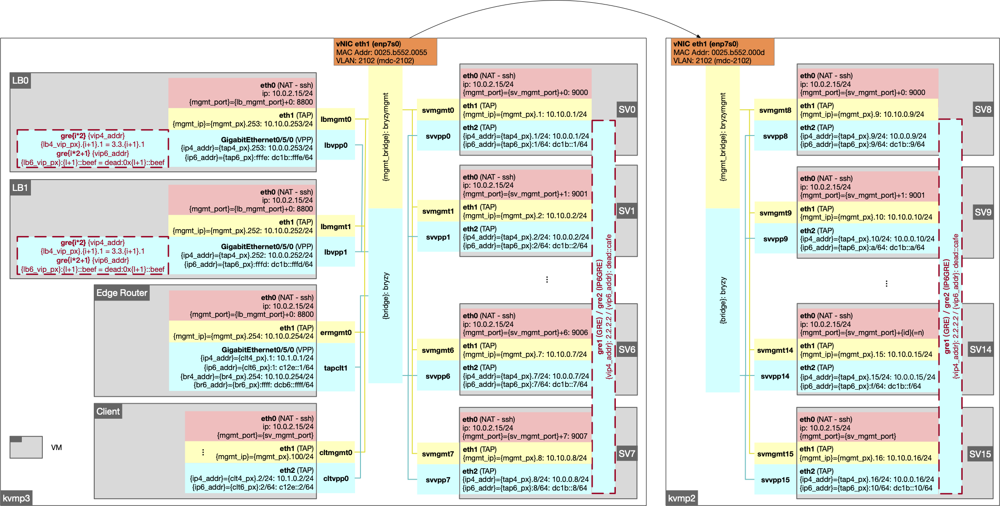
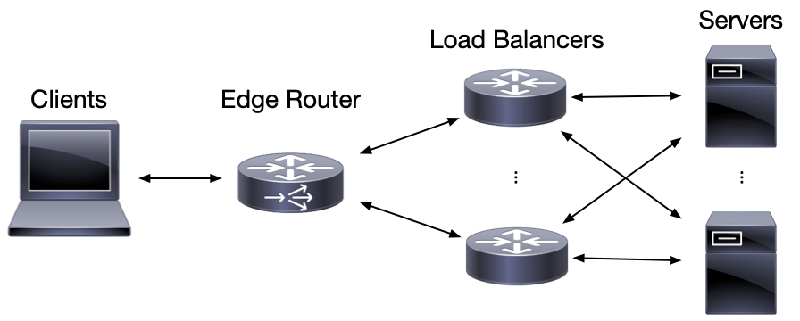
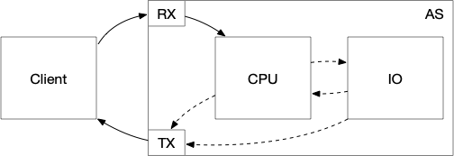
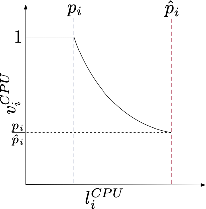
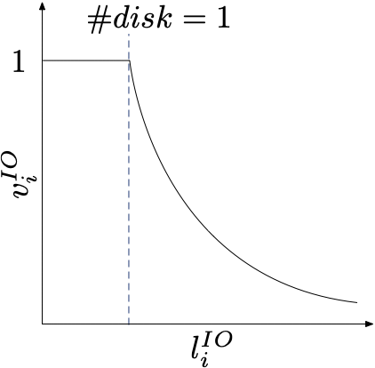

# MARL for Network LB in DC

To get started, go to [bootstrap.ipynb](notebooks/demo/bootstrap.ipynb).

# Emulation (Testbed)

## Description

Experiments are conducted on a realistic testbed running a real-world network trace on physical servers.
The experimental platform consists of VMs representing clients, an edge router, load-balancers and Apache HTTP server agents adopting the topology as in the Figure above. Detailed implemented testbed is depicted in the Figure below.

## Load Balancers

LB methods are implemented in the VPP platform, as VPP plugins. [VPP](https://wiki.fd.io/view/VPP) (Vector Packet Processor) is a high-performance packet-processing stack that can run on commodity CPUs, and that provides a framework that allows, in particular, to implement LB mechanisms. ECMP (based on round-robin dispatching), WCMP, LSQ, SED, active WCMP, and MARL LB (RLB-QMix, RLB-I-SAC, RLB-S-SAC), are implemented in VPP, and evaluated in the testbed. The bucket table size for LB methods is set to 65536 by default.

## Apache HTTP Servers

An Apache HTTP server [52] is running on each server node. Two metrics are gathered every 200ms as ground truth load state: CPU utilization, and the number of Apache busy worker threads. CPU utilization is calculated from the file `/proc/stat` and the amount of Apache busy threads is assessed via Apache’s scoreboard shared memory. The Apache servers use mpm_prefork module to boost performance. Each server has 32 worker threads and TCP backlog is set to 128. In the Linux kernel, the `tcp_abort_on_overflow` parameter is enabled, so that a TCP RST will be triggered when the queue capacity of TCP connection backlog is exceeded, instead of silently dropping the packet and waiting for a SYN retransmit. With this configuration, the FCT measures application response delays rather than potential TCP SYN retransmit delays.

## System Platform

The testbed resides on two machines, each with a 24-core Intel Xeon E5-2690 CPU. A 4-core traffic generator, representing the clients, and a 2-core edge router node, run on one machine. The other machine hosts 2-core VMs running LB instances using VPP. Apache HTTP servers are hosted on VMs with 1-4 cores depending on different configurations. The VMs are on the same Layer-2 link, with statically configured routing tables. Apache HTTP servers share the same virtual IP (VIP) address on one end of GRE tunnels with the LB on the other end.

## WikiPedia Replay

In order to evaluate their performance in presence of a realistic workload, LB methods are tested in a Wikipedia replay setup. An instance of MediaWiki 5 of version 1.30, a MySQL server and the `memcached` cache daemon are installed on each of the AS instance. WikiLoader tool and a copy of the English version of [Wikipedia database](https://www.academia.edu/download/30608665/2009.comnet-wiki.pdf), are used to populate MySQL databases. Each AS is an independent replica of the Wikipedia server. A traffic generator, representing clients, is used to generate a MediaWiki access trace and to record page response times.

## Miscellaneous

An example is demonstrated with [jupyter notebooks](notebooks/emulation).

# Simulation

## Description

The topology of the simulated DC networks is depicted in the Figure above.
As realistic network applications can be CPU- bound or IO-bound, the simulator allows to config- ure applications that require multi-stage processes switching between CPU and IO queues.

As depicted above, queries from clients are first processed by CPU, and then might be processed interchaningly in IO or CPU queue, before being replied. For instance, a query for a 2-stage application will firstly be processed in the CPU queue, and then in the IO queue, before being sent back to the client.

Processing models are different for CPU and IO queues.

As shown above, a blocked processor sharing model is defined for CPU queues, in which the instantaneous processing speed on a server is 1 if the number of ongoing tasks `l_cpu` in the CPU queue is no more than the number of worker threads `p`. There is a maximum number of queries `p_hat` that can be processed at any given moment. When `l_cpu > p`, the processing speed decreases to `l_cpu/min(p_hat, l_cpu)`. Flows that arrives when `l_cpu >= p_hat` will be blocked in a wait queue (similar to backlog in _e.g._ Apache) and will not be processed until there is an available slot in the CPU processing queue.

IO processing model is a simple processor sharing model, in which the instantaneous processing speed is defined as `1/max(1, l_io)`, where `l_io` denotes the number of ongoing tasks in the IO queue.

## LB Methods

The following mechanisms are implemented:

- **ECMP**: randomly distributes flows across servers
- **WCMP**: distributes flows across servers with statically configured probabilities proportional to the number of CPU cores
- **LSQ/GSQ**: distributes flows to servers with local or global shortest queue
- **SED**: dispatches flows to server whose expected delay (queue length over statically configured processing speed) is the shortest
- **RLB-SAC**: dispatches flows to server whose expected delay (queue length over adaptively learned processing speed) is the shortest

## Metrics

Flow completion time (FCT) measurement is used as metrics in this simulator. It allows to evaluate the overall QoS from clients’ point of view, and to verify service-level agreement (SLA) compliance. FCT is evaluated as the time between the sending of a request by a client and the reception of the response by the client. The lower the FCTs, the better QoS the server clusters provide. 

## Miscellaneous

Documentation of the simulator can be found [here](simulation/README.md).

An example is demonstrated with [jupyter notebooks](notebooks/simulation).